# **Fighting Wildfire with AI & Computer Vision** 🔥🚒🧑‍🚒
`PyTorch` approach to object detection of wildifre smoke with Faster R-CNN.

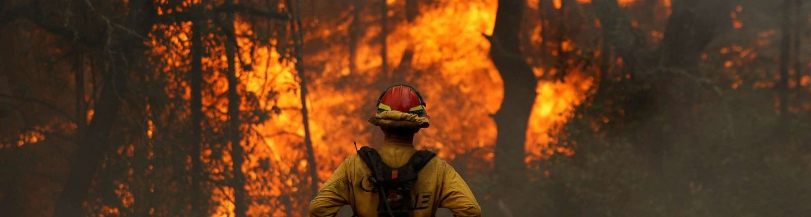

## 📖 **About**
When dealing with wildfires, especially forest wildfires, the response time on the part of firefighters is crucial. If it is possible, it is better to stop a fire in its birth, so as to avoid damage and waste of resources. For this reason, this project comes with the intention of creating an AI model (applied to Computer Vision) that can detect and identify smoke from a rising wildfire.

The goal is therefore to train a deep learning model to detect the first signs of smoke from a forest fire, with the ultimate hope of dispatching a drone to douse it with water before it gets out of control. Several images containing the first signs of smoke from a fire were collected. Currently, the images are collected only from weather towers which cover a subset of the areas at risk for fires. In this context, one of the biggest challenges for the model is determining the difference between smoke and clouds.

The [dataset](https://public.roboflow.com/object-detection/wildfire-smoke) is organized into three folders (train, validation and test) and contains a total of 737 images: 516 are reserved for training, 147 for validation and 74 for test. Each image, regardless of the category to which it belongs, has a bounding box around the wildfire smoke. All annotations are saved in a CSV.

Some examples of the training data are provided below.

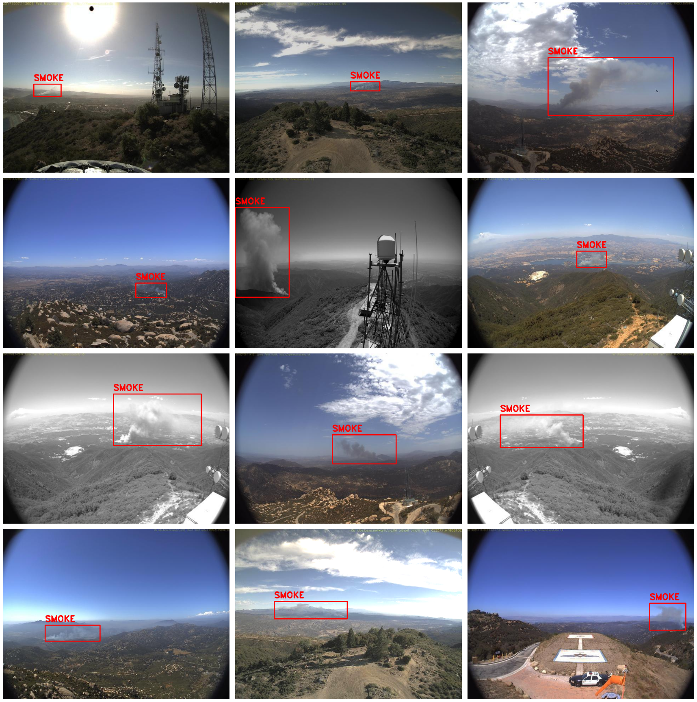 
<i>It is possible to observe that the images are of different types (RGB and greyscale). In addition, I emphasize the presence of clouds, which are problematic for the task of smoke detection.</i>

## 📌 **Helper functions**
In the *Detection* folder I manually imported some helper functions from the `torchvision` library. The [documentation](https://github.com/pytorch/vision/tree/main/references/detection) is available.

## 📝 **Results**
Through the use of `PyTorch` I build a Faster R-CNN for object detection, with the backbone of *ResNet 50*.

Detailed results and code implementation is available at [PyTorch - **Object Detection**](https://github.com/PaulinoMoskwa/Wildfire-Smoke-Detection/blob/master/PyTorch%20-%20Object%20Detection.ipynb). 
Moreover, a detailed description of the theory behind the method is available below, in the `README.md`. 

The Faster R-CNN performed very well selecting $\alpha = 0.6$ as the threshold. 
I performed an evaluation of the model on the test set, obtaining the following results.

 
<i>Model predictions on test images. In red the ground-truth boxes, in blue the predicted boxes.</i>

-----------------------------------------

# **Theoretical Overview**

## 📉 **Object detection metrics**
At a low-level, evaluating performance of an object detector boils down to determining if a detection is correct or not. Some useful metrics are:

* ***True Positive (TP)*** - Correct detection made by the model.
* ***False Positive (FP)*** - Incorrect detection made by the detector.
* ***False Negative (FN)*** - A ground-truth missed (not detected) by the object detector.
* ***True Negative (TN)*** - Backgound region correctly not detected by the model. 

To define those metrics, we need to introduce a further metric, called ***Intersection over Union (IoU)***.

IoU metric in object detection evaluates the degree of overlap between the ground truth (gt) and prediction (pd). 
The ground-truth and the prediction can be of any shape (rectangular box, circle, or even irregular shape). 
IoU metric is calculated as:

$\qquad\qquad IoU = \frac{\text{area}(gt\hspace{2pt}\cap\hspace{2pt} pd}{\text{area}(gt\hspace{2pt}\cup\hspace{2pt} pd)}$

IoU ranges between 0 and 1, where 0 shows no overlap and 1 means perfect overlap between gt and pd.

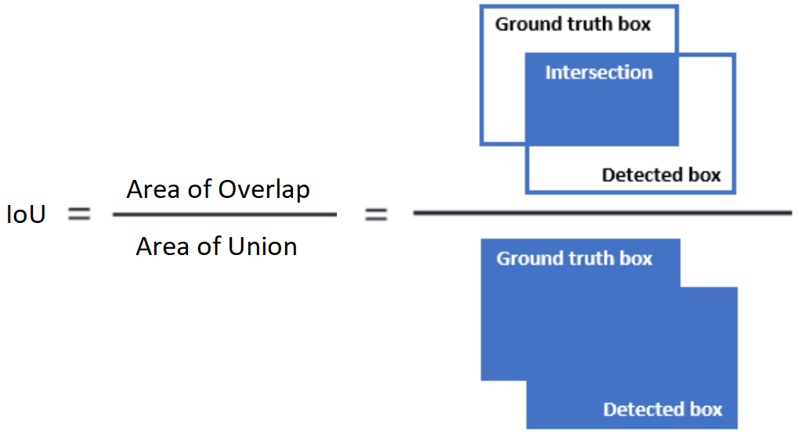

IoU is used combined with a threshold $\alpha$: using a threshold we can decide if a detection is correct or not. 
For IoU threshold at $\alpha$:
* True Positive (TP) is a detection for which: $IoU(gt, pd)\geq\alpha$
* False Positive (FP) is a detection for which: $IoU(gt, pd)<\alpha$
* False Negative (FN) is a ground-truth missed together with gt for which: $IoU(gt, pdf)<\alpha$. 

For example: consider IoU threshold, $\alpha=0.5$. 
Then TP, FP and FN can be identified as shown below:

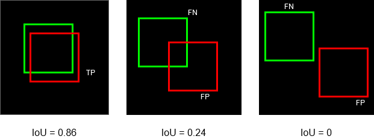 
<i>From left to right: TP, FP and FN, FP and FN.</i>

Note that, if we raise IoU threshold above 0.86, the first instance will be a FP (and FN), and if we lower IoU threshold below 0.24, the second instance becomes TP. The decision to make a detection as TP or FP and ground-truth as FN is completely contingent on the choice of IoU threshold, $\alpha$. 

We introduce two other metrics:
* ***Precision*** - Degree of exactness of the model in identifying only relevant objects.  
It is the ratio of TPs over all detections made by the model, namely:

$\quad\qquad\qquad Precision = \frac{TP}{TP \hspace{2pt}+\hspace{2pt} FP} = \frac{TP}{all\hspace{2pt}detections}$ 

* ***Recall*** - Measure of the ability of the model to detect all ground-truths instances. 
It is the ratio of TPs over all the ground-truths, namely:

$\quad\qquad\qquad Recall = \frac{TP}{TP \hspace{2pt}+\hspace{2pt} FN} = \frac{TP}{all\hspace{2pt}ground-truth}$

A model is said to be a good model if it has high precision and high recall. A perfect model has zero FNs and zero FPs (that is, precision=1 and recall=1). However, often, attaining a perfect model is not feasible.

As we saw above, the values of TP, FP and FN depend on the value of the threshold $\alpha$. Consequently, also the precision and recall metrics vary as the threshold $\alpha$ varies. For every possible $\alpha$ between 0 and 1, it is possible to obtain a pair of [precision, recall] points. It is possible then to plot all the points in a precision-recall plane by obtaining the so-called Precision-Recall (PR) curve. For a good model, precision and recall stays high even when confidence score is varied.

 
<i>Possible trend of the precision-recall curve as the threshold changes.</i>

Although the precision-recall curve can be used to evaluate the performance of a detector, it is not easy to compare among different detectors when the curves intersect with each other. It would be better if we have a numerical metric that can be used directly for the comparison. This is where ***Average Precision (AP)***, which is based on the precision-recall curve, comes into play. In essence, AP is the precision averaged across all unique recall levels.

Note that in order to reduce the impact of the wiggles in the curve, we first interpolate the precision at multiple recall levels before actually calculating AP. The interpolated precision $p_{interp}$ at a certain recall level $r$ is defined as the highest precision found for any recall level $r'\geq r$.

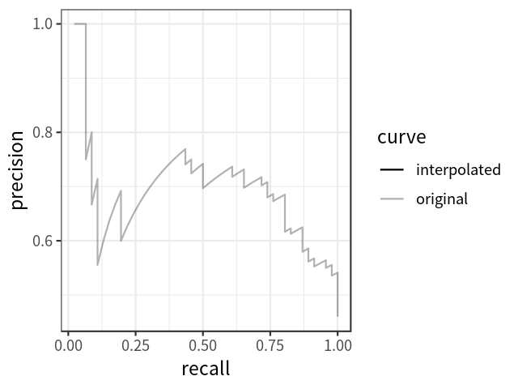 
<i>Interpolation of the precision-recall curve.</i>

AP can then be defined as the area under the interpolated precision-recall curve.

The calculation of AP only involves one class. However, in object detection, there are usually $K > 1$ classes. 
For this reason, ***Mean Average Precision (mAP)*** is introduced, defined as the mean of AP across all the K classes:

$\qquad\qquad mAP = \frac{1}{K}$ $\sum$ $_{i=1}^{K} AP_i$

-----------------------------------------

## 📟 **Object detection models - R-CNN, Fast R-CNN, Faster R-CNN**   (Region-based Convolutional Neural Network)

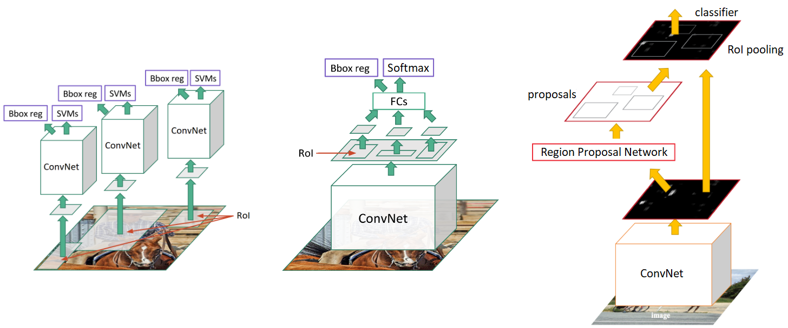 
<i>From left to right: R-CNN, Fast R-CNN, Faster R-CNN.</i>

Let us now look in detail at the ideas, structures, and functioning of each option.

-----------------------------------------

### 🥉 **R-CNN**
The structure of the Region-based Convolutional Neural Network (R-CNN) is the following:

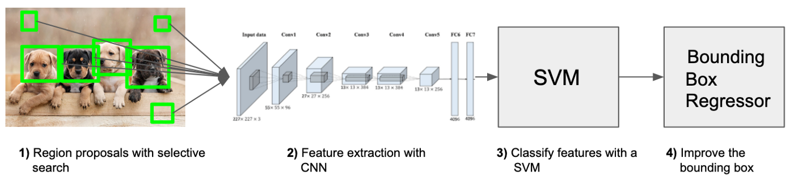

#### **1. Region proposals**
The problem the R-CNN system tries to solve it is to locate objects in an image (object detection). What can we do to solve this? We could start with a sliding window approach. When using this method, we just go over the whole image with different sized rectangles and look at those smaller images in a brute-force-method. The problem is, we will have a giant number of smaller images to look at. To our luck, region proposals have been introduced. Region proposals are just smaller parts of the original image, that we think could contain the objects we are looking for.

There are different region proposal algorithms. 
Tipically, the ***selective search method*** is used to generate region proposals. 
Algorithm of selective search:

1. Generate initial sub-segmentation of input image based on similarities of the regions (color, texture, size, filling, etc.).
2. Recursively combine the smaller similar regions into larger ones.  
   A greedy algorithm is used to combine similar regions to make larger regions. 
   Greedy algorithm:
    1. From a set of regions choose the two regions that are most similar.
	2. Combine the two chosen regions into a single larger region.
	3. Repeat the above stesp for multiple iterations.
3. Use the segmented regions proposals to generate candidate object locations.

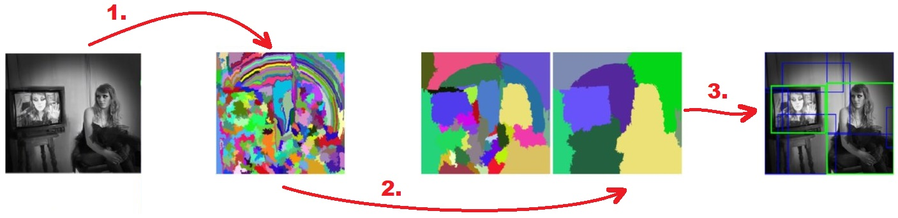 
<i>Visual representation of the selective search algorithm.</i>

#### **2. CNN** - Feature extractor
Once we have decided which boxes to analyze, we simply cut the image to extract the box and pass the cropped image to a standard convolutional neural network (CNN).

How do we train the feature extractor? This is the fundamental issue with the R-CNN system. It is not possible to train the whole system in one go (this will be solved by Fast R-CNN). Rather, every part of the system needs to be trained separately (independently).

Another important limit with R-CNN is that image proposals have different shapes. Many of them are smaller or larger than the required size. This leads to a stretching of the image to fit some predetermined dimensions for the CNN.

#### **3. SVM** - Classification
We created feature vectors from the image proposals. Now we will need to classify those feature vectors. We want to detect what class of object those feature vectors represent. For this, we use an SVM classificator. We have one SVM for each object class and we use them all. This means that for one feature vector we have *n* outputs, where *n* is the number of different objects we want to detect. The output is a confidence score: how confident we are that a particular feature vector represents a class.

#### **4. Bounding Box Regressor** - Bounding Box improvements
The Bounding Box Regressor is actually optional. In fact, it is not a fundamental building block of the R-CNN System. It’s a great idea though, and the authors found that it improves the average precision by 3%. The goal is to learn a transformation that maps a proposed box *P* to a ground-truth box *G*.

#### **5. Output**
Now we have image proposals that are classified on every object class. How do we bring them all back to the image? We use something called greedy non-maximum suppression. This is a fancy word for the following concept: ***reject a region (image proposal) if it has an intersection-over-union (IoU) overlap with a higher scoring selected region.***

We combine each region: if there is an overlap we take the proposal with the higher score (calculated by the SVM). We do this step for each object class independently. After this ends we only keep regions with a score higher than 0.5.

-----------------------------------------

### 🥈 **Fast R-CNN**
The selective search used in R-CNN generates around 2000 region proposals for each image and each region proposal is fed to the underlying network architecture. This means, for a single image, there’d be 2000 forward passes. Consider training the network with a dataset of 1000 images. That would be a total of a huge number of forward passes! Fast R-CNN was based on the idea that: ***why not consider running the CNN just once per image and then find a way to share that computation across the ~2000 proposals?***

The structure of the Fast Region-based Convolutional Neural Network (Fast R-CNN) is the following:

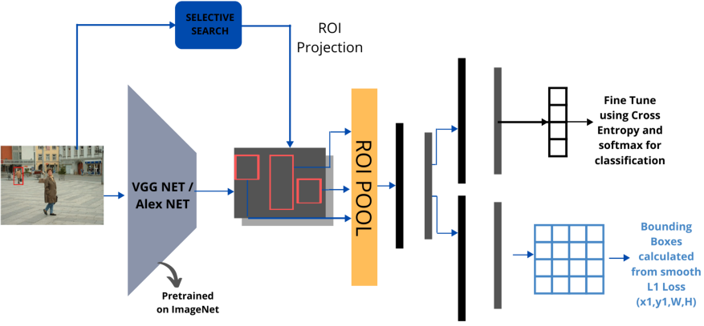

In Fast R-CNN, the image is fed to the underlying CNN just once and the selective search is run on the other hand as usual. These region proposals generated by selective search are then projected on to the feature maps generated by the CNN. This process is called ROI Projection (Region Of Interest). 

The idea of ROI projection is that we get the coordinates of the bounding box from the ROI proposal and we need to project them onto the feature maps by projecting the ROI proposal with respect to the subsampling ratio.

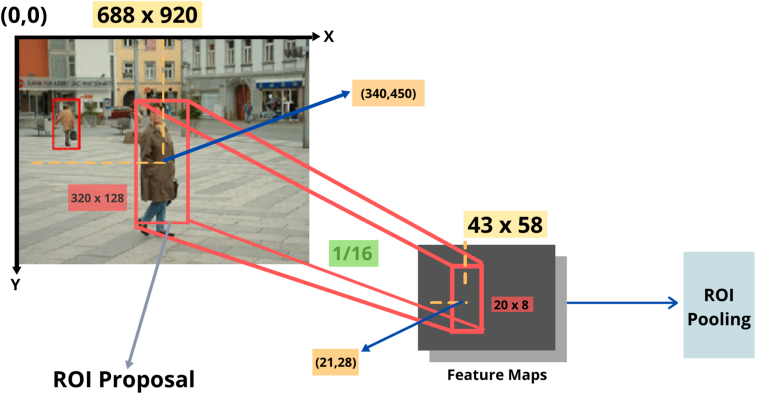

Finally, we also get rid of the last pooling layer. 
ROI Pooling is applied to the feature maps of the last convolution layer. 
The changes from R-CNN is that we got rid of the SVM classifier and we use Softmax instead. 
The result of Fast R-CNN is an exponential increase in terms of speed. In terms of accuracy, there’s not much improvement.

-----------------------------------------

### 🥇 **Faster R-CNN**

Even with all these advancements, there is still one remaining bottleneck in the Fast R-CNN process: the region proposer. The first step in detecting the objects is to generate a set of potential bounding boxes around the object. In Fast R-CNN, the region proposals are created using selective search, a pretty slow process (found to be the bottleneck of the overall object detection process). Thus, there is a need for a better technique, where it gives less than 2000 region proposals, faster than selective search, as accurate as selective search or better, and should be able to propose overlapping ROIs with different aspect ratios and scales.

From Fast R-CNN, we know that region proposals depend on features of the image that were already calculated with the forward pass of the CNN. ***So why don’t we reuse those same CNN results for region proposals instead of running a separate selective search algorithm?*** This translates with eliminating the selective search algorithm and letting the network learn the region proposals.

The structure of the Faster Region-based Convolutional Neural Network (Faster R-CNN) is the following:

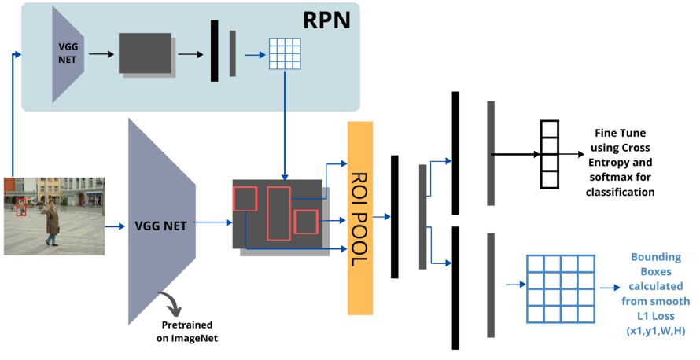

Similar to Fast R-CNN, the image is provided as an input to a convolutional network, which provides a convolutional feature map. Instead of using selective search algorithm on the feature map to identify the region proposals, a separate network is used to predict the region proposals. The predicted region proposals are then reshaped using a RoI pooling layer, which is then used to classify the image within the proposed region and predict the offset values for the bounding boxes.

The network which gives us the approximate ROIs is termed to be the ***Region Proposal Network(RPN)***. 
How do we design this RPN such that it gives us the approximate ROIs which can be further processed? 
We define the RPN as a ***Fully Convolutional Neural Network (F-CNN)*** (*).
The goal of this network is to assign to each point on the image K different estimates of a possible bounding box. These estimates are called ***anchors***. The training of this network is divided in two parts: a classification part is used to predict the probability of a pixel being included in the instance for which we're creating the anchors, a regression part is used to adjust each anchor to better match the location.

(*) *Fully Convolutional Neural Networks (F-CNN) are convolutional neural networks for which the fully connected layers are convolutionalized. We can write the output of each fully connected layer as the convolution of the input against a 1x1 filter. With a F-CNN we can take as input images of varing dimensions.*

In conclusion, Faster R-CNN results to be much faster than its predecessors. Therefore, it can even be used for real-time object detection.

-----------------------------------------

## 📰 **Resources**
[**1**] R-CNN https://medium.com/@selfouly/r-cnn-3a9beddfd55a 
[**2**] Fast R-CNN and Faster R-CNN https://towardsdatascience.com/understanding-fast-r-cnn-and-faster-r-cnn-for-object-detection-adbb55653d97 
[**3**] R-CNN vs. Fast R-CNN vs. Faster R-CNN https://jhui.github.io/2017/03/15/Fast-R-CNN-and-Faster-R-CNN/ 
[**4**] In-depth - Region Proposal Network (RPN) - pt. 1 https://www.youtube.com/watch?v=po59qI5LJGU&ab_channel=Cogneethi 
[**5**] In-depth - Region Proposal Network (RPN) - pt. 2 https://www.youtube.com/watch?v=AVTs_N8YhBw&ab_channel=Cogneethi 
[**6**] In-depth - Region Proposal Network (RPN) - pt. 3 https://www.youtube.com/watch?v=QvoGKKr987w&ab_channel=Cogneethi 
[**7**] Metrics https://blog.zenggyu.com/en/post/2018-12-16/an-introduction-to-evaluation-metrics-for-object-detection/  